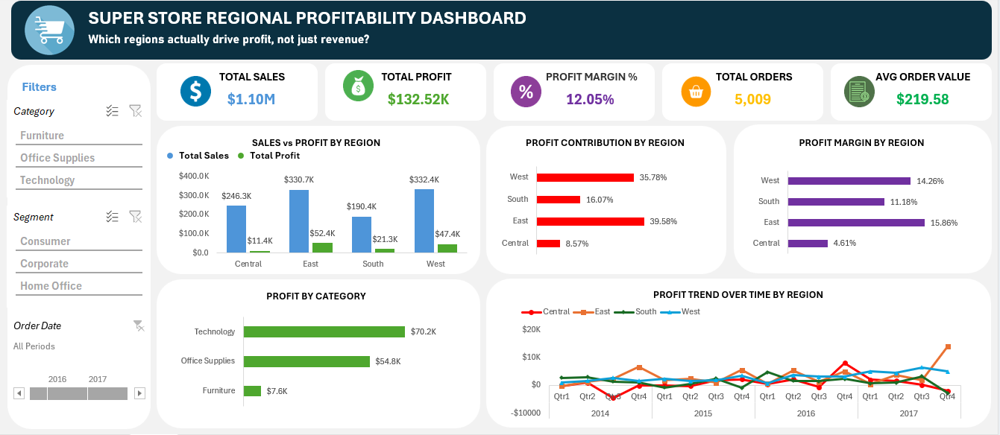

# Superstore Regional Profitability Dashboard (Excel)

## Business Question
Which regions and product categories are actually driving **profit** — not just revenue — and where is the business leaking margin?

## Data Source
[Kaggle Superstore Dataset](https://www.kaggle.com/datasets/vivek468/superstore-dataset-final) — 9,994 line items across 5,009 orders, spanning 2014–2017. Fields used: Order Date, Region, Category, Sub-Category, Segment, Sales, Profit, Quantity.

## Method
- Built entirely in Excel — no external BI tool
- KPI cards, slicers (Category, Segment, Order Date), and native PivotCharts
- Structure: raw transaction data → PivotTables → dashboard layer with cards, filters, and charts
- KPIs: Total Sales, Total Profit, Profit Margin %, Total Orders, Average Order Value
- Charts: Sales vs. Profit by Region, Profit Contribution by Region, Profit Margin by Region, Profit by Category, Profit Trend Over Time by Region (quarterly, 2014–2017)

## Key Findings
- Across 2014–2017: **$1.10M** in total sales generated **$132.5K** in profit (12.05% blended margin) across 5,009 orders — average order value $219.58
- **Central** region is the standout problem: it's not the lowest-revenue region ($246.3K, third of four), but it delivers by far the **weakest margin (4.61%)** and the **smallest profit contribution (8.57%)** of any region — less than a quarter of East's contribution despite comparable sales volume
- **East** and **West** are the real profit engines — together they generate **75% of total profit** (39.6% and 35.8% respectively) on margins over 14%
- **Furniture** is the category-level version of the same problem: it drives meaningful revenue but converts to only **$7.6K** in profit, versus **$70.2K** from Technology and **$54.8K** from Office Supplies — Technology alone delivers roughly 9x Furniture's profit
- The quarterly trend shows Central consistently underperforming other regions rather than a one-off dip — this is a structural margin issue, not seasonal noise

## Files
- `Superstore_Regional_Profitability_Dashboard.xlsx` — the full workbook (dashboard + underlying PivotTables/raw data)
- Dashboard screenshot used for the LinkedIn post

## What I'd Do Next
- Dig into *why* Central underperforms — pricing, discounting behavior, or shipping/cost structure specific to that region
- Break out Furniture sub-categories (Chairs, Tables, Bookcases, Furnishings) to see if the margin drag is concentrated in one or two products rather than the whole category
- Rebuild the same regional-profitability question in SQL + Python (Project 3–5) to compare tooling tradeoffs and validate the finding independently
